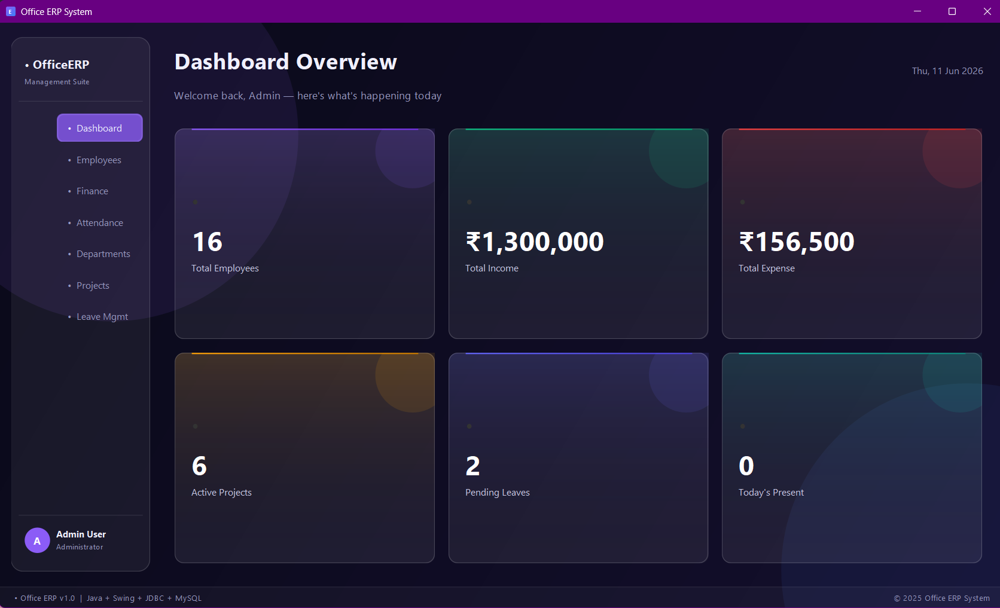
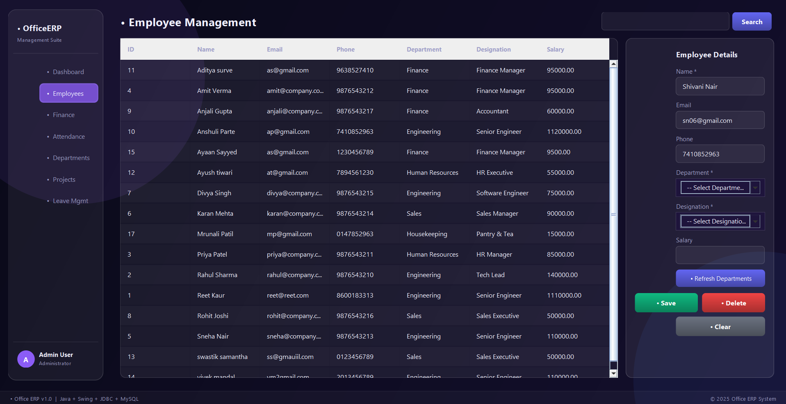
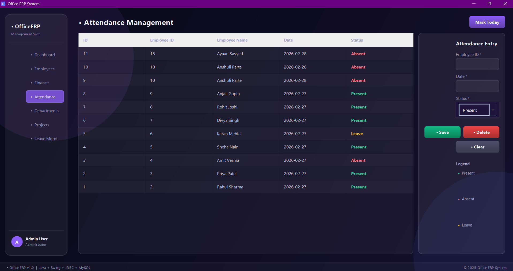

# Office ERP Management System

A desktop-based Enterprise Resource Planning (ERP) application developed using Core Java, Java Swing, JDBC, and MySQL. The system streamlines office operations by providing modules for employee management, attendance tracking, project monitoring, finance records, department administration, and leave management.

## Features

* Employee Management
* Department Administration
* Attendance Tracking
* Leave Management
* Project Monitoring
* Finance Record Management
* Interactive Java Swing User Interface
* MySQL Database Integration via JDBC

## Tech Stack

* Core Java
* Java Swing
* JDBC
* MySQL

## Project Structure

The application follows a modular desktop architecture where each functional area is managed through dedicated Swing interfaces connected to a centralized MySQL database.

## Requirements

* JDK 8 or higher
* MySQL Server
* MySQL JDBC Connector (`mysql-connector-j-9.6.0.jar`)

## Installation & Execution

Compile the project:

cd C:\Users\lenovo\OneDrive\Desktop\Projects\ERP
del *.class
javac -cp ".;mysql-connector-j-9.6.0.jar" *.java
java -cp ".;mysql-connector-j-9.6.0.jar" Main

## Database Configuration

Before running the application, update the database credentials and JDBC connection URL in `DBConnection.java` according to your local MySQL setup.

## Screenshots

### Dashboard

### Employee Management

### Attendance Module

## Academic Purpose

This project was developed as a Second-Year B.Sc. IT Core Java Mini Project to demonstrate practical implementation of GUI-based application development, database connectivity, and ERP system concepts.
